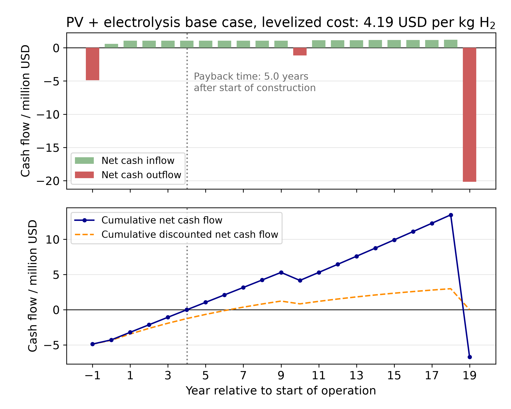

# Examples

Runnable examples illustrating how to use pyH2A from a Python script.

Name | Description
--- | ---
`net_cash_flow_PV_E_Base.py` | Reading the cash flow over time from a discounted cash flow analysis and plotting it for the `PV_E_Base_test.md` case

## Net cash flow over time

`Discounted_Cash_Flow_Plugin` calculates the cash flow of the plant for every year of the analysis period. The data is available under the `Cash Flow` table of the input dictionary and as attributes of the plugin object:

```python
from pyH2A.Discounted_Cash_Flow import Discounted_Cash_Flow

dcf = Discounted_Cash_Flow('src/tests/end_to_end/PV_E_Base_test.md', print_info = False)

years = dcf.inp['Time']['Years']['Value']['Plant years relative'].unit['-']
net_cash_flow = dcf.inp['Cash Flow']['Annual']['Value'].unit['USD']
cumulative_cash_flow = dcf.inp['Cash Flow']['Cumulative']['Value'].unit['USD']
payback_time = dcf.inp['Cash Flow']['Payback time']['Value'].unit['year']
```

The cash flow arrays cover the construction years followed by the operation years, so they share their time axis with `Time > Years > Value > Plant years relative`.

Run the example from the repository root:

```bash
python examples/net_cash_flow_PV_E_Base.py
```

It prints the levelized cost of hydrogen and the payback time and saves the following plot to the `Example_Output` directory:



The upper panel shows the net cash flow of each individual year, the lower panel the cumulative net cash flow, which turns positive at the payback time. The cumulative discounted net cash flow is shown for comparison: it returns to zero at the end of the plant life, since the levelized cost of product is defined by this condition.
